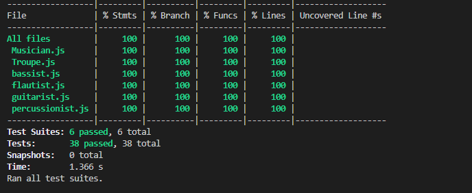

# Automation Testing Part

## The date of execution

11/08/2022

# Test coverage for the project




# Manual Testing Part

## 1. Create a musician

### Data requirements for musicians are:

- Musician name between 3 and 30 characters
- Must play one of the four instruments below
- Years playing must be non-negative
- Hourly rate must be over 50

### Instruction:

- select option 1 from the main menu -> select one instrument from the provided list -> enter musician name -> enter musician years of playing -> enter musician hourly rate

The table below shows user input, expected output and actual output in details.<br>

User select option 1 from the main menu, and it will display a message as below.

```diff
! Please enter your choice [1,2,3,4,5,6,7,8,9]:

User can choose from the provided insturments list and a message will show as below.

! 1. Guitar
! 2. Bass
! 3. Percussion
! 4. Flute
! Please select one instrument:
```

| User Input | Expected Output                                   | Actual Output                                     |
| ---------- | ------------------------------------------------- | ------------------------------------------------- |
| 1          | Please put in musician name(3-30 characters):     | Please put in musician name(3-30 characters)::    |
| 2          | Please put in musician name(3-30 characters):     | Please put in musician name(3-30 characters)::    |
| 3          | Please put in musician name(3-30 characters):     | Please put in musician name(3-30 characters)::    |
| 5          | ERROR, please enter the number within given range | ERROR, please enter the number within given range |

The date of execution:11/08/2022

User can put in musicians name.<br />
User can put in between 3 and 30 characters. <br />
A message will show as below.<br />

```diff
! Please put in musician name(3-30 characters):
```

| User Input | Expected Output                              | Actual Output                                |
| ---------- | -------------------------------------------- | -------------------------------------------- |
| Red        | Please put in years of playing(minimum 0.1): | Please put in years of playing(minimum 0.1): |
| Blue       | Please put in years of playing(minimum 0.1): | Please put in years of playing(minimum 0.1): |
| Pink       | Please put in years of playing(minimum 0.1): | Please put in years of playing(minimum 0.1): |
| CC         | ERROR, please enter within range             | ERROR, please enter within range             |

The date of execution:11/08/2022

User can put in years of playing.<br />
User input must be non-negative.<br>
A message will display as below. <br />

```diff
! Please put in years of playing(minimum 0.1): 
```

| User Input | Expected Output                          | Actual Output                            |
| ---------- | ---------------------------------------- | ---------------------------------------- |
| \-10       | ERROR, please enter valid number         | ERROR, please enter valid number         |
| 10         | Please put in hourly rate(more than 50): | Please put in hourly rate(more than 50): |
| 5          | Please put in hourly rate(more than 50): | Please put in hourly rate(more than 50): |
| 100000     | ERROR, please enter valid number         | ERROR, please enter valid number         |

The date of execution:11/08/2022

User can put in hourly rate.<br />
Hourly rate should be more than 50.<br>
A message will display as below. <br />

```diff
! Please put in hourly rate(more than 50):
```

| User Input | Expected Output                                                                                       | Actual Output                                                                                         |
| ---------- | ----------------------------------------------------------------------------------------------------- | ----------------------------------------------------------------------------------------------------- |
| 40         | ERROR, please enter valid number                                                                      | ERROR, please enter valid number                                                                      |
| 80         | Musician Name: Pink,<br>  Musician Instrument: Guitar,<br>  Year of Playing: 1,<br>  Hourly Rate: 80, | Musician Name: Pink,<br>  Musician Instrument: Guitar,<br>  Year of Playing: 1,<br>  Hourly Rate: 80, |
| 110        | Musician Name: Red,<br>  Musician Instrument: Guitar,<br>  Year of Playing: 1,<br>  Hourly Rate: 110, | Musician Name: Red,<br>  Musician Instrument: Guitar,<br>  Year of Playing: 1,<br>  Hourly Rate: 110, |
| 10000000   | ERROR, please enter valid number                                                                      | ERROR, please enter valid number                                                                      |

The date of execution:11/08/2022

# 2. Create a troupe

## Data requirements for musicians are:

- Name between 3 and 30 characters
- No more than 5 musicians
- Valid genre from (rock, jazz, pop)
- Minimum duration in hours between 0.5 and 3

### Instruction:

- select option 2 from the main menu -> enter troupe name -> enter duration hours -> select one genre

The table below shows user input, expected output and actual output in details.<br>
User select option 2 from the main menu, and it will display a message as below.<br>

```diff
! Please put in troupe name(3-30 characters):
```

| User Input | Expected Output                               | Actual Output                                 |
| ---------- | --------------------------------------------- | --------------------------------------------- |
| Troupe 1   | Please put in hours(between 0.5 and 3 hours): | Please put in hours(between 0.5 and 3 hours): |
| Troupe 2   | Please put in hours(between 0.5 and 3 hours): | Please put in hours(between 0.5 and 3 hours): |
| Troupe 3   | Please put in hours(between 0.5 and 3 hours): | Please put in hours(between 0.5 and 3 hours): |
| AA         | ERROR, please enter within range              | ERROR, please enter within range              |

The date of execution:11/08/2022

User can put minimum duration in hours. <br />
Minimum duration in hours between 0.5 and 3.<br>
A message will display as below. <br />

```diff
! Please put in hours(between 0.5 and 3 hours):
```

| User Input | Expected Output                                                  | Actual Output                                                    |
| ---------- | ---------------------------------------------------------------- | ---------------------------------------------------------------- |
| 0.1        | ERROR, please enter valid number                                 | ERROR, please enter valid number                                 |
| 4          | ERROR, please enter valid number                                 | ERROR, please enter valid number                                 |
| 3          | 1. Rock<br> 2. Jazz<br> 3. Pop<br> <br> Please select one genre: | 1. Rock<br> 2. Jazz<br> 3. Pop<br> <br> Please select one genre: |
| 1          | 1. Rock<br> 2. Jazz<br> 3. Pop<br> <br> Please select one genre: | 1. Rock<br> 2. Jazz<br> 3. Pop<br> <br> Please select one genre: |

The date of execution:11/08/2022

User can choose a genre.<br>
User can choose from the provided genre list and a message will show as below.

```diff
! 1. Rock
! 2. Jazz
! 3. Pop
! Please select one genre:
```

| User Input | Expected Output                                                                  | Actual Output                                                                    |
| ---------- | -------------------------------------------------------------------------------- | -------------------------------------------------------------------------------- |
| 1          | Troupe Name: Troupe 1,<br>Troupe Genre: Rock,<br>Minimum Booking time: 1 hours,  | Troupe Name: Troupe 1,<br>Troupe Genre: Rock,<br>Minimum Booking time: 1 hours,  |
| 2          | Troupe Name: Troupe 2,<br>Troupe Genre: Rock,<br>Minimum Booking time: 2  hours, | Troupe Name: Troupe 2,<br>Troupe Genre: Rock,<br>Minimum Booking time: 2  hours, |
| 3          | Troupe Name: Troupe 3,<br>Troupe Genre: Pop,<br>Minimum Booking time: 2  hours,  | Troupe Name: Troupe 3,<br>Troupe Genre: Pop,<br>Minimum Booking time: 2  hours,  |
| 4          | ERROR, please enter the number within given range                                | ERROR, please enter the number within given range                                |

The date of execution:11/08/2022

# 3. Add musicians to a troupe

## Instruction:

- select option 3 from the main menu -> select a troupe -> select musicians -> enter Y/N to continue adding musicians or not -> enter Y/N to continue choose another troupe

There are six musicians have been created for testing.

The table below shows user input, expected output and actual output in details.<br>
User select option 3 from the main menu, and it will display a troupe list for user to choose and a message as below:

```diff
! 1. Troupe 1
! 2. Troupe 2
! 3. Troupe 3

! Please select a troupe:
```

| User Input | Expected Output                                                                                                                                               | Actual Output                                                                                                                                                 |
| ---------- | ------------------------------------------------------------------------------------------------------------------------------------------------------------- | ------------------------------------------------------------------------------------------------------------------------------------------------------------- |
| 1          | You have selected: Troupe 1<br>Musician List<br>1\. Pink<br>2\. Red<br>3\. Blue<br>4.Black<br>5.White<br>6.Yellow<br>Please select musicians(no more than 5): | You have selected: Troupe 1<br>Musician List<br>1\. Pink<br>2\. Red<br>3\. Blue<br>4.Black<br>5.White<br>6.Yellow<br>Please select musicians(no more than 5): |
| 2          | You have selected: Troupe 2<br>Musician List<br>1\. Pink<br>2\. Red<br>3\. Blue<br>4.Black<br>5.White<br>6.Yellow<br>Please select musicians(no more than 5): | You have selected: Troupe 2<br>Musician List<br>1\. Pink<br>2\. Red<br>3\. Blue<br>4.Black<br>5.White<br>6.Yellow<br>Please select musicians(no more than 5): |
| 4          | ERROR, please enter the number within given range                                                                                                             | ERROR, please enter the number within given range                                                                                                             |
| 5          | ERROR, please enter the number within given range                                                                                                             | ERROR, please enter the number within given range                                                                                                             |

The date of execution:11/08/2022

User can select musicians.<br>
Maxmum 5 musicians can be selected.<br>
A message will display as below. <br />

```diff
! Please select musicians(no more than 5):
```


| User Input | Expected Output                                                                | Actual Output                                                                  |
| ---------- | ------------------------------------------------------------------------------ | ------------------------------------------------------------------------------ |
| 7          | ERROR, please enter the number within given range                              | ERROR, please enter the number within given range                              |
| 1          | You have selected troupe: Troupe 1 and musicians: Pink                         | You have selected troupe: Troupe 1 and musicians: Pink                         |
| 2          | You have selected troupe: Troupe 1 and musicians: Pink,Red                     | You have selected troupe: Troupe 1 and musicians: Pink,Red                     |
| 3          | You have selected troupe: Troupe 1 and musicians: Pink,Red,Blue                | You have selected troupe: Troupe 1 and musicians: Pink,Red,Blue                |
| 4          | You have selected troupe: Troupe 1 and musicians: Pink,Red,Blue,Black          | You have selected troupe: Troupe 1 and musicians: Pink,Red,Blue,Black          |
| 5          | You have selected troupe: Troupe 1 and musicians: Pink,Red,Blue,Black,White    | You have selected troupe: Troupe 1 and musicians: Pink,Red,Blue,Black,White    |
| 6          | Sorry, no more than 5 musicians in a troupe.                                   | Sorry, no more than 5 musicians in a troupe.                                   |
| 1          | ERROR, musician already exists<br>Do you want to select another troupe Y or N: | ERROR, musician already exists<br>Do you want to select another troupe Y or N: |

The date of execution:11/08/2022

User enter Y or N to continue adding musicians or not.<br>
A message will display as below. <br />

```diff
! Contiue to add musicians Y or N:
```

| User Input | Expected Output                                                                                                       | Actual Output                                                                                                         |
| ---------- | --------------------------------------------------------------------------------------------------------------------- | --------------------------------------------------------------------------------------------------------------------- |
| Y          | Musician List<br>1\. Pink<br>2\. Red<br>3\. Blue<br>4.Black<br>5.White<br>6.Yellow                                    | Musician List<br>1\. Pink<br>2\. Red<br>3\. Blue<br>4.Black<br>5.White<br>6.Yellow                                    |
| y          | Musician List<br>1\. Pink<br>2\. Red<br>3\. Blue<br>4.Black<br>5.White<br>6.Yellow                                    | Musician List<br>1\. Pink<br>2\. Red<br>3\. Blue<br>4.Black<br>5.White<br>6.Yellow                                    |
| N          | Do you want to select another troupe Y or N:                                                                          | Do you want to select another troupe Y or N:                                                                          |
| n          | Do you want to select another troupe Y or N:                                                                          | Do you want to select another troupe Y or N:                                                                          |
| t          | You have selected Troupe 1 troupe and it includes musicians: Pink,Red<br>Do you want to select another troupe Y or N: | You have selected Troupe 1 troupe and it includes musicians: Pink,Red<br>Do you want to select another troupe Y or N: |

The date of execution:11/08/2022

User enter Y or N to choose another troupe or not.<br>
A message will display as below. <br />

```diff
! Do you want to select another troupe Y or N:
```

| User Input | Expected Output                                                             | Actual Output                                                               |
| ---------- | --------------------------------------------------------------------------- | --------------------------------------------------------------------------- |
| Y          | 1\. Troupe 1<br>2\. Troupe 2<br>3\. Troupe 3<br><br>Please select a troupe: | 1\. Troupe 1<br>2\. Troupe 2<br>3\. Troupe 3<br><br>Please select a troupe: |
| y          | 1\. Troupe 1<br>2\. Troupe 2<br>3\. Troupe 3<br><br>Please select a troupe: | 1\. Troupe 1<br>2\. Troupe 2<br>3\. Troupe 3<br><br>Please select a troupe: |
| N          | Back to Main Menu                                                           | Back to Main Menu                                                           |
| n          | Back to Main Menu                                                           | Back to Main Menu                                                           |
| b          | Back to Main Menu                                                           | Back to Main Menu                                                           |

The date of execution:11/08/2022

# 6. Show hourly cost for a troupe

## Instruction:

- select option 6 from the main menu -> select a troupe -> enter hour values

The table below shows user input, expected output and actual output in details.<br>
User select option 6 from the main menu, and it will display a troupe list for user to choose and a message as below.

```diff
! 1. Troupe 1
! 2. Troupe 3
! 3. Troupe 2

! Please select a troupe:
```

User can put in hours values after selecting a troupe from the list above.<br>
Minimum duration in hours between 0.5 and 3.<br>
A message will display as below.<br>

```diff
! Please put in hours(between 0.5 and 3):
```

| User Input | Expected Output                                    | Actual Output                                      |
| ---------- | -------------------------------------------------- | -------------------------------------------------- |
| 0.1        | ERROR, please enter valid number                   | ERROR, please enter valid number                   |
| 0.5        | Total cost of Troup Troupe 1 for 0.5 hours is: 200 | Total cost of Troup Troupe 1 for 0.5 hours is: 200 |
| 2          | Total cost of Troup Troupe 1 for 2 hours is: 800   | Total cost of Troup Troupe 1 for 2 hours is: 800   |
| 3          | Total cost of Troup Troupe 2 for 3 hours is: 600   | Total cost of Troup Troupe 2 for 3 hours is: 600   |
| 5          | ERROR, please enter valid number                   | ERROR, please enter valid number                   |

The date of execution:11/08/2022
